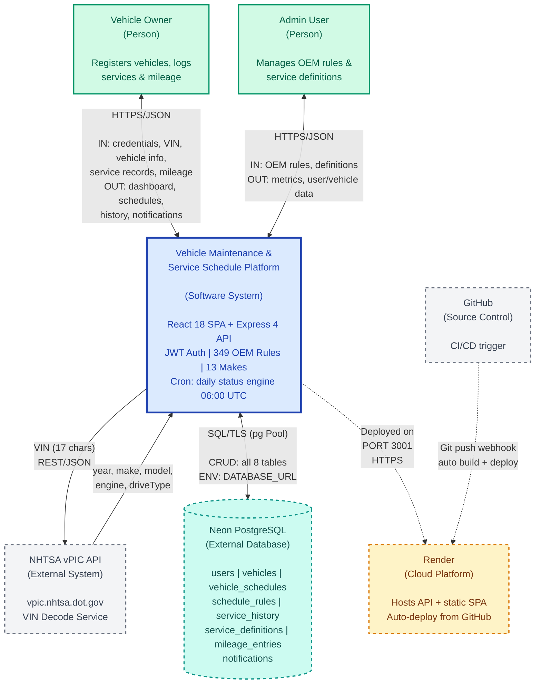

# System Context Diagram - Vehicle Maintenance & Service Schedule Platform

**Data Flow Context | React + Express + PostgreSQL | Hosted on Render | March 2026**

## Legend

- **Blue** = Core System
- **Green** = Person/Actor
- **Dashed borders** = External System
- **Solid arrows** = Data flow
- **Dashed arrows** = Async/deployment flow

## Components Description

### Central System
- **Frontend**: React 18 + Vite + Tailwind CSS + TypeScript
- **Backend**: Express 4 + TypeScript + PostgreSQL (pg Pool)
- **Authentication**: Custom JWT + bcrypt (4-source token extraction)
- **OEM Rules**: 349 maintenance schedules across 13 makes, 40+ models
- **Automation**: Daily cron job at 06:00 UTC for status calculation

### External Systems
- **NHTSA vPIC API**: VIN decoding service (REST/JSON)
- **Neon PostgreSQL**: Cloud database with 8 tables (users, vehicles, vehicle_schedules, schedule_rules, service_history, service_definitions, mileage_entries, notifications)
- **Render**: Cloud hosting platform (auto-deploy from GitHub)
- **GitHub**: Source control + CI/CD trigger

### Actors
- **Vehicle Owner**: Registers vehicles, logs services, tracks mileage, views maintenance schedules
- **Admin User**: Manages OEM maintenance rules and service definitions

## Data Flow Summary

### Vehicle Owner → System (HTTPS/JSON)
- **IN**: Login credentials, VIN, vehicle information, service records, mileage entries
- **OUT**: Dashboard view, maintenance schedules, service history, notifications

### Admin User → System (HTTPS/JSON)
- **IN**: OEM maintenance rules, service definitions
- **OUT**: System metrics, user data, vehicle statistics

### System → NHTSA vPIC API (REST/JSON)
- **Request**: VIN (17 characters)
- **Response**: Year, make, model, engine, drive type

### System ↔ Neon PostgreSQL (SQL/TLS)
- Connection via `pg` Pool using `DATABASE_URL` environment variable
- CRUD operations across all 8 tables
- TLS-encrypted connection

### GitHub → Render (Webhook)
- Git push triggers automatic build and deployment
- Deploys from `feature/postgres-migration` branch

## Deployment

- **Live URL**: https://vehicle-maintenance-uc4a.onrender.com
- **Port**: 3001
- **Branch**: feature/postgres-migration
- **Demo Credentials**: demo@example.com / Demo1234!
